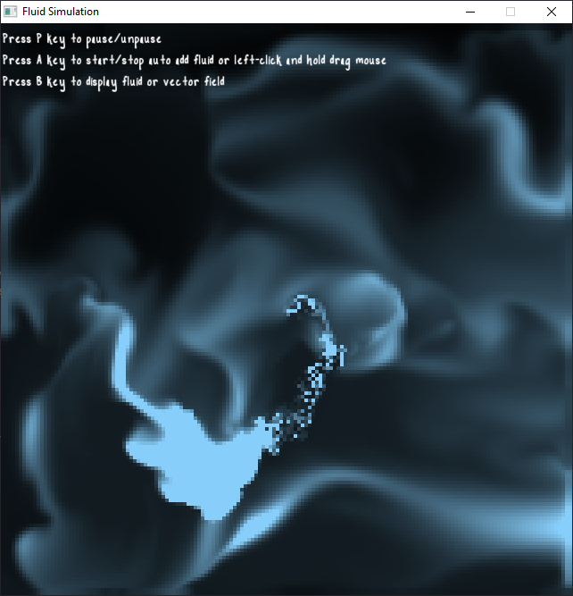
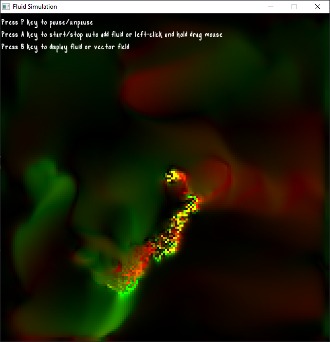

Fluid Simulation

This is Mike Ashes work converted to be used for 2D instead of 3d and rendered using the SFML library which you can find here:

https://mikeash.com/pyblog/fluid-simulation-for-dummies.html

This is meant to be a learning experience for myself. The plan is to use vulkan compute shaders to process the simulation on the
GPU.

compile:
you can run the buildme.sh script

Tested on: MSVC, MSYS2 (MinGW64), Linux (Manjaro)

